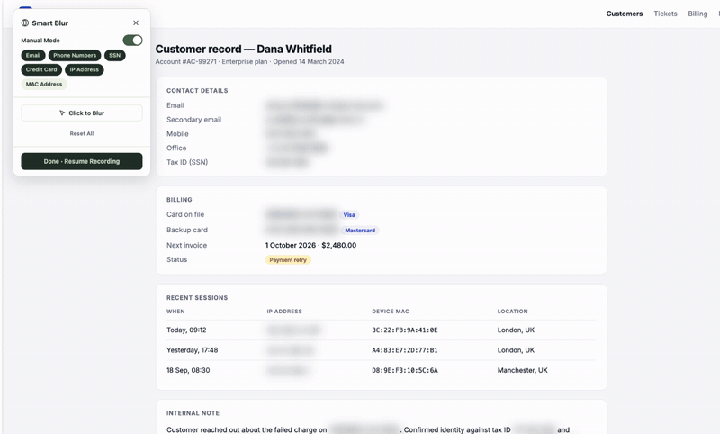
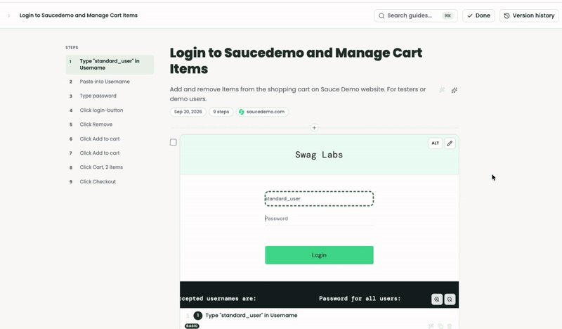
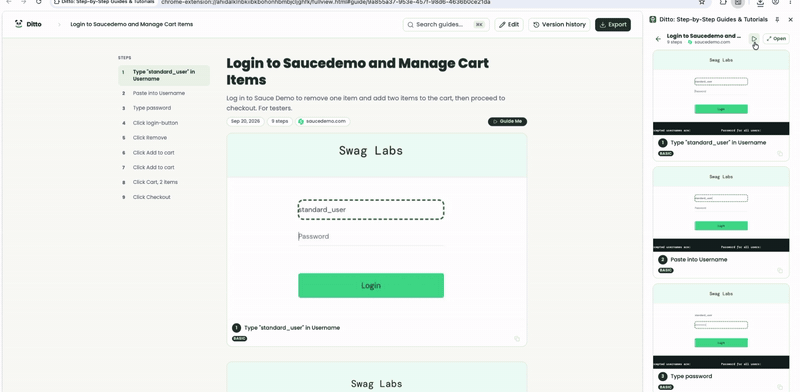
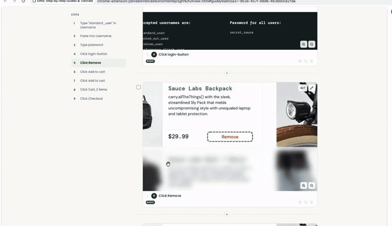
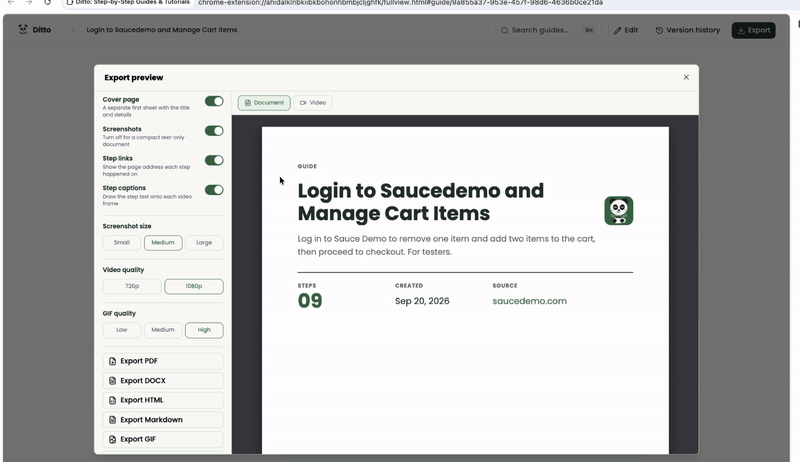

# Ditto

**Auto-capture any browser workflow into a step-by-step guide. No account, no cloud, no tracking.**

Click record, do the thing, get a polished guide with annotated screenshots. Narrate it as you go, edit it after, then replay or export.

<!-- SHIELD GROUP -->

[![Website][website-shield]][website-link]
[![License][license-shield]][license-link]
[![Manifest V3][mv3-shield]][mv3-link]
[![100% Local][local-shield]][local-link]
[![No Account][no-account-shield]][no-account-link]
 
[![Stars][star-shield]][star-link]
[![Contributors][contributors-shield]][contributors-link]
![Last Commit][last-commit-shield]
[![Issues][issues-shield]][issues-link]

<kbd>Table of contents</kbd>

#### TOC

- [📺 Demo](#-demo)
- [👋 Getting Started](#-getting-started)
- [✨ Features](#-features)
  - [🔒 Smart Blur](#-smart-blur)
  - [🧠 AI descriptions (optional)](#-ai-descriptions-optional)
  - [▶️ Guide Me replay](#️-guide-me-replay)
  - [🎙️ Voice narration (optional)](#️-voice-narration-optional)
  - [✏️ Guide editor](#️-guide-editor)
  - [📤 Multi-format export](#-multi-format-export)
- [🔐 Privacy & storage](#-privacy--storage)
- [🤝 Contributing](#-contributing)
- [⭐ Star History](#-star-history)
- [📜 License](#-license)

 

## 📺 Demo

<video src="https://github.com/user-attachments/assets/33cfa162-7530-4aa0-84ad-f2e1a688abd3" controls width="800"></video>

## 👋 Getting Started

Ditto turns any repetitive browser task into a documented, shareable guide in seconds. It runs entirely in your browser. No backend, no account, no telemetry, and nothing ever leaves your device.

Whether you're documenting internal tools, writing product tutorials, or onboarding a teammate, Ditto captures every click, keystroke, and navigation automatically so you can focus on the work.

Every meaningful action becomes a step: clicks on buttons and links, form inputs, keyboard shortcuts, clipboard actions, drag events, and page navigations. Rapid clicks on nearby elements are merged so guides stay clean, and clicks are intercepted before the page navigates away, so nothing is lost on SPAs or full page loads.

Each step gets a screenshot with the clicked element highlighted and zoomed in. No manual cropping, no annotation tools to learn.

| Browser | Version | Install |
| ------- | ------- | ------- |
| Chrome  | [![Chrome Version][chrome-version-shield]][chrome-link]   | [Chrome Web Store][chrome-link] *(pending)* |
| Firefox | [![Firefox Version][firefox-version-shield]][firefox-link] | [Firefox Add-ons][firefox-link] *(pending)* |
| Edge    | [![Edge Version][edge-version-shield]][edge-link]          | [Microsoft Edge Add-ons][edge-link] *(pending)* |

All three listings are in review. In the meantime you can [install from source](docs/install-from-source.md) — download a build from the [latest release](https://github.com/tryskyforge/ditto/releases/latest) and load it in about a minute.

Once it's installed, a short setup walks you through pinning the extension, turning on voice narration, and connecting a model if you want AI-written step descriptions. All of it is optional and can be skipped.

<video src="https://github.com/user-attachments/assets/0379929d-5c7c-40a1-a9e9-36fa6493bbea" controls width="800"></video>

> \[!IMPORTANT]
>
> **⭐️ Star the repo** if Ditto saves you time. It helps other people discover it!

[![Back to top][back-to-top]](#readme-top)

## ✨ Features

### 🔒 Smart Blur

Ditto automatically detects and blurs sensitive data in your screenshots: emails, phone numbers, SSNs, credit cards, IP addresses, MAC addresses. Toggle each category independently.

Need to blur something custom? The manual blur picker lets you select any DOM element and mask it across every screenshot where it appears.

[![Back to top][back-to-top]](#readme-top)

### 🧠 AI descriptions (optional)

Bring your own API key, or point Ditto at a model you run yourself, and it generates human-readable step descriptions like *"Click the **Submit** button to save changes"* instead of the rule-based `Click Submit`.

Descriptions are generated from a lightweight DOM context (~50-100 tokens), not screenshots. Roughly 15-30x cheaper than vision models. Choose the language you want descriptions in (English, Spanish, Portuguese, French, German, Chinese).

Prefer to keep everything on your own hardware? Pick **Your own server** and point Ditto at Ollama, LM Studio, vLLM, llama.cpp or a LiteLLM gateway — see [Using your own model server](docs/self-hosted-ai.md).

[![Back to top][back-to-top]](#readme-top)

### ▶️ Guide Me replay

Replay any guide live on a real page. Ditto highlights the next element to click, tracks your progress step by step, and advances automatically as you interact. Perfect for onboarding teammates or walking through a process yourself.

[![Back to top][back-to-top]](#readme-top)

### 🎙️ Voice narration (optional)

Talk through the workflow out loud while you record and Ditto turns what you said into the step
descriptions. Audio is transcribed by OpenAI, Groq or your own whisper server, and matched to the steps it
belongs to, so you narrate once instead of writing every step by hand.

[![Back to top][back-to-top]](#readme-top)

### ✏️ Guide editor

Fix a guide after the fact without re-recording. Crop, annotate and redact any screenshot, rewrite a
step with AI inline, drop headings and notes between steps, reorder or bulk-delete, and roll back
through version history.

[![Back to top][back-to-top]](#readme-top)

### 📤 Multi-format export

Share guides in whatever format fits your workflow:

- **Video**: narrated walkthrough, mp4/H.264, with the cursor moving to each target
- **PDF**: print-ready, A4 portrait with auto page breaks
- **DOCX**: open and keep editing in Word
- **HTML**: self-contained, share anywhere, base64-embedded images
- **Markdown**: paste into Notion, GitHub, internal docs, wikis

All exports are generated client-side. Nothing touches a server.

[![Back to top][back-to-top]](#readme-top)

## 🔐 Privacy & storage

Guides, steps, and screenshots live on your device. There's no backend, no account, no telemetry. Your API keys (if you bring one) never leave your browser — they're stored locally and used to call the provider you chose directly.

Two things do leave the browser, both documented in the [privacy policy](https://tryskyforge.github.io/ditto/privacy.html): site icons are fetched from Google's favicon service, which sends that site's domain, and the optional AI and voice features send text or audio to the provider you configured.

[![Back to top][back-to-top]](#readme-top)

## 🤝 Contributing

Contributions of all kinds are welcome: bug reports, feature requests, PRs, and translations.

See [CONTRIBUTING.md](./CONTRIBUTING.md) for development setup, project layout, and contributor guidelines.

[![Back to top][back-to-top]](#readme-top)

## ⭐ Star History

<a href="https://www.star-history.com/#tryskyforge/ditto&Timeline">
  <picture>
    <source media="(prefers-color-scheme: dark)" srcset="https://api.star-history.com/svg?repos=tryskyforge/ditto&type=Timeline&theme=dark" />
    <source media="(prefers-color-scheme: light)" srcset="https://api.star-history.com/svg?repos=tryskyforge/ditto&type=Timeline" />
    
  </picture>
</a>

[![Back to top][back-to-top]](#readme-top)

## 📜 License

MIT © [Skyforge AI](https://github.com/tryskyforge). See [LICENSE](./LICENSE) for details.

[![Back to top][back-to-top]](#readme-top)

<!-- LINK GROUP -->

[back-to-top]: https://img.shields.io/badge/-BACK_TO_TOP-23362B?style=flat-square

[website-shield]: https://img.shields.io/badge/website-tryskyforge.github.io%2Fditto-3D6B47?style=flat-square&labelColor=23362B
[website-link]: https://tryskyforge.github.io/ditto/
[license-shield]: https://img.shields.io/badge/license-MIT-3D6B47?style=flat-square&labelColor=23362B
[license-link]: ./LICENSE

[mv3-shield]: https://img.shields.io/badge/manifest-v3-3D6B47?style=flat-square&labelColor=23362B
[mv3-link]: https://developer.chrome.com/docs/extensions/mv3/intro/

[local-shield]: https://img.shields.io/badge/storage-100%25%20local-3D6B47?style=flat-square&labelColor=23362B
[local-link]: #-100-local-storage

[no-account-shield]: https://img.shields.io/badge/account-not%20required-3D6B47?style=flat-square&labelColor=23362B
[no-account-link]: #-100-local-storage

[star-shield]: https://img.shields.io/github/stars/tryskyforge/ditto?style=flat-square&label=stars&color=3D6B47&labelColor=23362B
[star-link]: https://github.com/tryskyforge/ditto/stargazers

[contributors-shield]: https://img.shields.io/github/contributors/tryskyforge/ditto?style=flat-square&labelColor=23362B
[contributors-link]: https://github.com/tryskyforge/ditto/graphs/contributors

[last-commit-shield]: https://img.shields.io/github/last-commit/tryskyforge/ditto?style=flat-square&label=commit&labelColor=23362B

[issues-shield]: https://img.shields.io/github/issues/tryskyforge/ditto?style=flat-square&labelColor=23362B
[issues-link]: https://github.com/tryskyforge/ditto/issues

[chrome-version-shield]: https://img.shields.io/badge/Chrome-in%20review-8C8579?style=flat-square&logo=googlechrome&logoColor=CFE0C8&labelColor=23362B
<!-- once published, swap the line above for:
[chrome-version-shield]: https://img.shields.io/chrome-web-store/v/ipcgbegaacaepfkmfllmaojdlenhedao?label=Chrome%20Version&style=flat-square&logo=googlechrome&logoColor=CFE0C8&color=3D6B47&labelColor=23362B -->
[chrome-link]: https://chromewebstore.google.com/detail/ditto/ipcgbegaacaepfkmfllmaojdlenhedao
[firefox-version-shield]: https://img.shields.io/badge/Firefox-in%20review-8C8579?style=flat-square&logo=firefoxbrowser&logoColor=CFE0C8&labelColor=23362B
<!-- once published, swap the line above for:
[firefox-version-shield]: https://img.shields.io/amo/v/ditto-skyforgeai?label=Firefox%20Version&style=flat-square&logo=firefoxbrowser&logoColor=CFE0C8&color=3D6B47&labelColor=23362B -->
[firefox-link]: https://addons.mozilla.org/en-US/firefox/addon/ditto-skyforgeai/
[edge-version-shield]: https://img.shields.io/badge/Edge-in%20review-8C8579?style=flat-square&logo=microsoftedge&logoColor=CFE0C8&labelColor=23362B
<!-- once published, swap the line above for:
[edge-version-shield]: https://img.shields.io/badge/dynamic/json?url=https%3A%2F%2Fmicrosoftedge.microsoft.com%2Faddons%2Fgetproductdetailsbycrxid%2Fempdagcgkgnnppmfdajbmldbghhbnboi&query=%24.version&label=Edge%20Version&style=flat-square&logo=microsoftedge&logoColor=CFE0C8&color=3D6B47&labelColor=23362B -->
[edge-link]: https://microsoftedge.microsoft.com/addons/detail/empdagcgkgnnppmfdajbmldbghhbnboi
</content>
</invoke>
